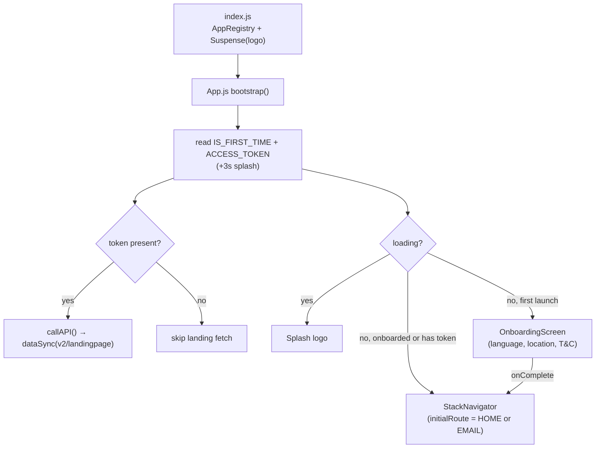
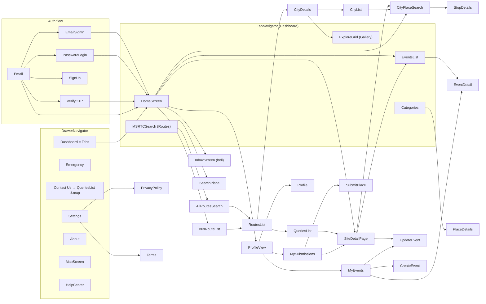
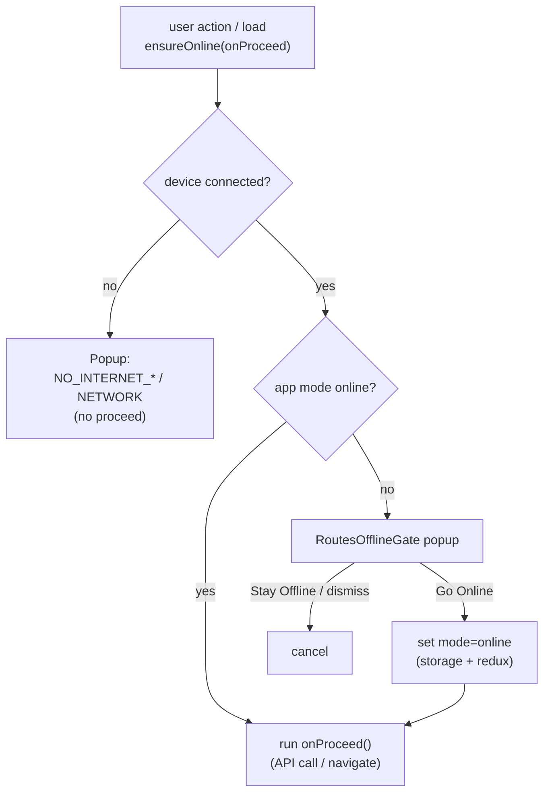

# Tourkokan Mobile (tourkokan-v2) — Reverse-Engineering & Architecture Doc

> Generated by walking the code from `index.js` → `App.js` → navigators → screens →
> components → services. It maps the live flow, what each screen does, which
> components/methods it uses, and lists dead/unused code.
>
> Legend: ✅ live (reachable in normal use) · ⚠️ registered but unreachable (legacy route) · ❌ dead file (not registered, not imported in a live path) · 🔎 verify on device.

---

## 1. App bootstrap flow (entry → first screen)

```
index.js
  └─ AppRegistry.registerComponent(App)
       └─ <Suspense fallback={logo}>  (i18n lazy load)
            └─ App.js
                 ├─ Firebase init (firebase/app)
                 ├─ analytics().setAnalyticsCollectionEnabled(true)
                 ├─ AppState listener → SecurityOverlay (hides UI in app switcher)
                 ├─ bootstrap():
                 │    ├─ read IS_FIRST_TIME + ACCESS_TOKEN (+3s splash delay)
                 │    ├─ setHasToken(!!token)
                 │    ├─ initialRoute = token ? HOME : EMAIL
                 │    ├─ SplashScreen.hide()
                 │    └─ if token → callAPI() → dataSync(landingpage)
                 ├─ setupAxiosInterceptors()
                 └─ RENDER GATE:
                      if (loading)              → splash logo
                      else if (isFirstTime==='false' || hasToken)
                                                → <Provider><StackNavigator initialRoute/></Provider>
                      else                      → <OnboardingScreen/>   (first-ever launch)
```

Global providers wrapping the app: `redux <Provider>`, `UpdateContext.Provider`
(app-update pending flag), `SafeAreaProvider`, `GlobalAlertProvider`, plus
`UpdateOverlay` (force/optional update) and `SecurityOverlay`.

---

## 2. Navigation tree (live)

```
StackNavigator (initialRoute = EMAIL | HOME)
│
├─ Email (auth landing)  ──► EmailSignIn / PasswordLogin / SignUp / VerifyOTP ──► HOME
│
├─ HOME / MAIN = DrawerNavigator
│   ├─ Drawer item: Dashboard      = TabNavigator
│   │     ├─ HomeTab     = HomeScreen
│   │     ├─ Gallery     = ExploreGrid
│   │     ├─ Routes      = MSRTCSearch        (+ MSRTCSearchPanel)
│   │     ├─ Categories  = Categories
│   │     └─ Events      = EventsList
│   ├─ Drawer item: Emergency      = Emergency
│   ├─ Drawer item: Contact Us     = QueriesList   ⚠️(loads QueriesList, not ContactUs)
│   ├─ Drawer item: Settings       = Settings
│   ├─ Drawer item: About          = AboutScreen
│   ├─ Drawer item: Map            = MapScreen
│   ├─ Drawer item: Help Center    = HelpCenterScreen
│   ├─ (Drawer route) PrivacyPolicy= PrivacyPolicyScreen
│   └─ (Drawer route) Terms        = TermsScreen
│
└─ Pushed (stack) screens reachable from the tabs:
    SiteDetailPage, CityDetails, CityPlaceSearch, CityList, BusRouteList,
    AllRoutesSearch, RoutesList, SearchPlace, StopDetails, PlaceDetails,
    ProfileView → (Profile, MyEvents, MySubmissions), SubmitPlace, EventsList,
    EventDetail, CreateEvent, UpdateEvent, InboxScreen, ExploreGrid, MapScreen
```

### Navigation edges (who → opens → what), live only

| From | Opens |
|------|-------|
| App bootstrap | Email **or** Home(Drawer) |
| Email | EmailSignIn, PasswordLogin, SignUp, VerifyOTP, Home |
| EmailSignIn / PasswordLogin / VerifyOTP | Home |
| HomeScreen | CityPlaceSearch, SiteDetailPage, ProfileView, EventsList, **BusRouteList** (bus btn) |
| TopComponent (in Home header) | InboxScreen (bell), openDrawer |
| SiteDetailPage | CityPlaceSearch (villages→see more), EventsList, UpdateEvent |
| CityDetails | CityDetails (sub), CityList, Gallery |
| MSRTCSearch / MSRTCSearchPanel | SearchPlace, AllRoutesSearch |
| AllRoutesSearch | RoutesList |
| BusRouteList | RoutesList, MSRTCSearch |
| RoutesList | CityDetails, QueriesList |
| Categories | PlaceDetails |
| CityList | CityPlaceSearch |
| EventsList | EventDetail |
| MyEvents | CreateEvent, EventDetail, UpdateEvent, ProfileView |
| MySubmissions | SubmitPlace, SiteDetailPage, ProfileView |
| ProfileView | Profile, MyEvents, MySubmissions |
| QueriesList | SiteDetailPage |
| Settings | Dashboard, PrivacyPolicy, Terms |
| Emergency / Weather | Dashboard / Home |

---

## 2a. Mermaid diagrams

> These render automatically on GitHub and in VS Code (Markdown Preview Mermaid
> support). `✅` live · `⚠️` legacy/unreachable.

### 2a.1 Bootstrap / entry decision



### 2a.2 Navigation graph (live screens)



### 2a.3 Connectivity gate decision (`useConnectivityGate.ensureOnline`)



---

## 3. Screen inventory (table)

> "Reached from" = inbound navigation in the live app. Route key = `STRING.SCREEN.*`.

| Screen file | Route key | Registered in | Reached from | Purpose / key methods | Notable components | API calls | Status |
|---|---|---|---|---|---|---|---|
| `HomeScreen.js` | HOME_TAB | Tab | App / login | landing data init, NetInfo sync, mode popup, unread poll, pull-to-refresh, city select | TopComponent, HotPlaces, Banner, LocationSheet(BottomSheet), Popup, useConnectivityGate | `v2/landingpage`, `v2/unreadMessageCount` | ✅ |
| `ListPages/ExploreGrid.js` | GALLERY / EXPLOREGRID | Tab + Stack | Gallery tab | gallery grid, pagination, image viewer | CachedImage, Popup, useGuestGate, useConnectivityGate | `v2/getGallery` | ✅ |
| `ListPages/MSRTCSearch.js` | ROUTES | Tab + Stack | Routes tab | bus route search shell, recent routes | MSRTCSearchPanel, Banner, useRoutesOfflineGate | (panel-driven) | ✅ |
| `ListPages/Categories.js` | CATEGORIES | Tab + Stack | Categories tab | category list (cache-first dataSync) | Cards, dataSync | `v2/listcategories` | ✅ |
| `ListPages/EventsList.js` | EVENTS_LIST | Tab + Stack | Events tab / Home / SiteDetail | events list+filter+pagination (gated) | useConnectivityGate | `v2/listEvents` | ✅ |
| `DetailPages/SiteDetailPage.js` | SITE_DETAIL | Stack | Home, MySubmissions, QueriesList, StopList | site detail, fav/rating, comments, gallery, villages, events, pull-to-refresh | CommentsSheet, HotPlaces, Banner, GuestGate, useConnectivityGate | `v2/getSite`, `v2/addDeleteFavourite`, `v2/addUpdateRating` | ✅ |
| `DetailPages/CityDetails.js` | CITY_DETAILS | Stack | RoutesList, Explore⚠️ | city detail, fav/rating, comments, pull-to-refresh | CommentsSheet, MapContainer, HotPlaces, PackageCard, useConnectivityGate | `v2/getSite`, fav/rating | ✅ |
| `DetailPages/EventDetail.js` | EVENT_DETAIL | Stack | EventsList, MyEvents | event detail, fav/share, gallery upload/delete | (own UI) | `v2/getEvent`, `shareEvent`, `uploadEventGallery`, `deleteEventGallery` | ✅ |
| `DetailPages/StopDetails.js` | STOP_DETAILS | Stack | CityPlaceSearch | bus stop detail | — | (verify) | 🔎 |
| `DetailPages/PlaceDetails.js` | PLACE_DETAILS | Stack | Categories | place detail | CommentsSheet | (verify) | 🔎 |
| `ListPages/CityPlaceSearch.js` | CITY_PLACE_SEARCH | Stack | Home, SiteDetail, CityList | global search (initial/typed/paginate — all gated) | useGuestGate, useConnectivityGate | `v2/sites` | ✅ |
| `ListPages/CityList.js` | CITY_LIST | Stack | CityDetails, Accordian | city/village list | Cards, mode alert | `v2/sites`/list | ✅ |
| `ListPages/BusRouteList.js` | BUS_ROUTE_LIST | Stack | Home (bus btn) | bus routes list (cache-first + gated fetch + pagination) | useConnectivityGate | `v2/routes` | ✅ |
| `ListPages/AllRoutesSearch.js` | ALL_ROUTES_SEARCH | Stack | MSRTCSearchPanel, SearchPanel | route search results | useRoutesOfflineGate | routes search | ✅ |
| `ListPages/RoutesList.js` | ROUTES_LIST | Stack | AllRoutesSearch, BusRouteList, SearchList⚠️ | route results list | — | routes | ✅ |
| `SearchPlace.js` | SEARCH_PLACE | Stack | MSRTCSearchPanel, SearchPanel, RoutesSearchPanel | source/destination place picker | — | places | ✅ |
| `ProfileView.js` | PROFILE_VIEW | Stack | Home, MyEvents, MySubmissions | profile, wallet, referral (blurred for guest), vendor request, pull-to-refresh | GuestGate, useConnectivityGate, CodeChip | `myRoleRequests`, `requestRole`, profile sync | ✅ |
| `Profile.js` | PROFILE | Stack | ProfileView | edit profile container | UpdateProfile (ProfileViews) | `updateProfile` | ✅ |
| `MyEvents.js` | MY_EVENTS | Stack | ProfileView | user's events (cache-first + gated) | useConnectivityGate, AppDialog | `v2/myEvents`, `deleteEvent` | ✅ |
| `MySubmissionsScreen.js` | MY_SUBMISSIONS | Stack | ProfileView | user's submitted sites (cache-first + gated) | useConnectivityGate, AppDialog | `v2/mySubmissions`, `deleteMySubmission` | ✅ |
| `SubmitPlaceScreen.js` | SUBMIT_PLACE | Stack | MySubmissions | add/edit a site submission | TextField | submit place | ✅ |
| `CreateEvent.js` / `UpdateEvent.js` | CREATE_EVENT / UPDATE_EVENT | Stack | MyEvents / SiteDetail | create/update event forms | — | create/update event | ✅ |
| `InboxScreen.js` | INBOX | Stack | TopComponent bell | messages list (mode-guarded) | — | `v2/myMessages`, `readMessage` | ✅ |
| `Emergency.js` | EMERGENCY | Drawer | drawer | emergency contacts (cache-first dataSync + gated) | useConnectivityGate | `v2/listcategories`, `v2/sites` | ✅ |
| `ListPages/QueriesList.js` | QUERIES_LIST / CONTACT_US | Stack + Drawer | RoutesList, drawer "Contact Us" | FAQ/queries list + pagination | — | `v2/getQueries` | ✅ |
| `ContactUs.js` | CONTACT_US | Stack | — (drawer maps to QueriesList) | contact form | mode alert | query submit | ⚠️ |
| `Settings.js` | SETTINGS | Drawer | drawer | mode toggle, language, update check | ModePopup, TopComponent | `updateProfile` | ✅ |
| `MapScreen.js` | MAP_SCREEN | Drawer + Stack | drawer | map view | MapContainer | — | ✅ |
| `HelpCenterScreen.js` | HELP_CENTER | Drawer + Stack | drawer | help/FAQ | — | — | ✅ |
| `AboutScreen.js` / `PrivacyPolicyScreen.js` / `TermsScreen.js` | ABOUT / PRIVACY_POLICY / TERMS | Drawer | drawer/Settings | static content | — | — | ✅ |
| `OnboardingScreen.js` | — | App.js | first launch | language, location, T&C, referral | Dropdown, sliders | — | ✅ |
| Auth: `Email.js`, `EmailSignIn.js`, `PasswordLogin.js`, `SignUp.js`, `VerifyOTP.js` | EMAIL/.../VERIFY_OTP | Stack | auth flow | login/register/otp | TextField, Popup | `auth/login`, register, otp | ✅ |

### Registered but **unreachable** (legacy routes — ⚠️)

These are wired into a navigator but **no live screen navigates to them** (their only inbound links are from other dead screens):

| Screen | Route | Note |
|---|---|---|
| `CategoryProjects.js` | CATEGORY_PROJECTS | projects feature (legacy) |
| `ListPages/ProjectList.js` | PROJECT_LIST | only reached from CategoryProjects (dead) |
| `DetailPages/ProjectDetails.js` | PROJECT_DETAILS | only from ProjectList/CategoryProjects (dead) |
| `ListPages/StopList.js` | STOP_LIST | only from Place_catList (dead file) |
| `ListPages/SearchList.js` | SEARCH_LIST | referenced only in commented code |
| `ListPages/Explore.js` | EXPLORE | old explore screen; nothing navigates in |
| `BusTimings.js` | BUS_TIMINGS | no inbound nav found |
| `AuthScreens/AuthScreen.js` | AUTH_SCREEN | old auth entry |
| `AuthScreens/SignIn.js` | LOGIN | superseded by Email/EmailSignIn |
| `AuthScreens/LangSelection.js` | LANG_SELECTION | registration commented out |

---

## 4. Shared components (most-used) 

| Component | Role | Used by (examples) |
|---|---|---|
| `Common/useConnectivityGate.js` | **Hook** — offline/online gate + "Go Online" popup (`ensureOnline`, `modal`) | Home, SiteDetail, CityDetails, MySubmissions, MyEvents, Emergency, ExploreGrid, EventsList, CityPlaceSearch, BusRouteList, MSRTCSearchPanel, TopComponent, UpdateProfile |
| `Common/RoutesOfflineGate.js` | The "Internet Required / Go Online" modal + `useRoutesOfflineGate` | used by useConnectivityGate; MSRTCSearch, AllRoutesSearch |
| `Common/Popup.js` | Generic info modal (icon + message) | many screens (alerts/errors) |
| `Common/GuestGateModal.js` | `useGuestGate`, `isGuestUser`, `isVendorUser`, guest counters | search, gallery, detail pages, profile |
| `Common/AppDialog.js` | `useAppDialog` (confirm/delete dialogs) | MyEvents, MySubmissions |
| `Common/TopComponent.js` | Home header (menu, location pill, bell→Inbox, profile) | HomeScreen, Settings, Food❌ |
| `Common/CommentsSheet.js` | Comments bottom sheet | SiteDetail, CityDetails, PlaceDetails |
| `Common/MSRTCSearchPanel.js` | Source/dest inputs + search btn (gated) | MSRTCSearch |
| `Common/LocationSheet.js` | City picker bottom sheet | HomeScreen |
| `Common/GlobalAlert.js` | App-wide alert host (`showAlert`) | global |
| `Common/MapContainer.js` / `MapSkeleton.js` | Google map view | detail pages, MapScreen |
| `Sections/HotPlaces.js` (+ `PopularSpots.js → TrendingCard`) | "Hot Places" carousel (responsive cards) | Home, SiteDetail, CityDetails |
| `Customs/Banner.js` | Carousel/ad/hero banner (aspect/cover) | Home, detail pages, lists |
| `Customs/CachedImage.js` | Image with cache + fallback | cards, grids |
| `Customs/BottomSheet.js`, `TextField.js`, `Text.js`, `Loader.js`, `DropDown.js`, `Accordian.js` | Primitives | across app |
| `Cards/*` | CityCard, PlaceCard, PackageCard, CategoryCard, SubCatCard, RouteHeadCard, ProjectCard (+ skeletons) | lists/detail |

---

## 5. Services / state / config layers

| Layer | File | Role |
|---|---|---|
| API client | `Services/Api/CommonServices.js` | `comnPost`, `comnGet`, `comnPostForm`, `dataSync` (cache-first), `getFromStorage`/`saveToStorage`, `isOffline` |
| API config | `Services/Api/AxiosInterceptor.js`, `BaseUrl.js`, `Endpoints.js` | axios setup, base URL, endpoint map |
| Helpers | `Services/CommonMethods.js` | `navigateTo`, `backPage`, `goBackHandler`, `checkLogin`, `showAlert`, `exitApp` |
| Responsive | `Services/responsive.js` | `useResponsive`, `moderateScale`, `isTablet`, `MAX_CONTENT_WIDTH` (tablet support) |
| Constants | `Services/Constants/{STRINGS,COLORS,DIMENSIONS,FIELDS}.js` | i18n keys, palette, sizing, form fields |
| State | `Reducers/{CommonActions,CommonReducer,Types}.js` + `Store.js` | redux: `access_token`, `mode`, `source`/`destination`, `loader`, `isLoading`, `profilePicture` |
| Context | `Context/UpdateContext.js` | app-update-pending flag |
| i18n | `localization/i18n.js` + `translations/{en,mr}.json` | English + Marathi |
| Native/SDK | Firebase (analytics, app), FCM, SplashScreen, VersionCheck, NetInfo, Maps | — |

---

## 6. Connectivity-gate system (key cross-cutting feature)

Built this session — see `docs/offline-mode-connectivity-guard.md`.

- **Modes** (stored key `mode`, redux `commonState.mode`): Online / Offline, independent of device internet.
- **`useConnectivityGate().ensureOnline(onProceed)`** decides per the matrix:
  1. connected + online → run action
  2. connected + offline mode → **RoutesOfflineGate "Go Online"** popup (switches mode, then runs)
  3. no internet → informational `Popup`
- **Background polls** (`unreadMessageCount`, `myMessages`) are **silently skipped** in offline mode (no popup).
- Gated entry points: pull-to-refresh (Home/SiteDetail/CityDetails/MySubmissions/MyEvents/Emergency), Gallery/Search/Bus/Events pagination & loads, vendor request, Add Site/Add Event, Home bus/events buttons, bell→Inbox, MSRTC source/dest/search, Edit-Profile save, SiteDetail "villages → see more".

---

## 7. Unused / dead code (safe-to-review-for-removal)

### ❌ Dead screen files (not registered, not imported in any live path)
- `Screens/Advertise.js`
- `Screens/Food.js`
- `Screens/Pricing.js`
- `Screens/Weather.js`
- `Screens/SearchScreen.js`
- `Screens/DetailPages/Place_catDetails.js`
- `Screens/ListPages/Place_catList.js`
- `Screens/ListPages/Categories copy.js`  ← literal "copy" file
- `Screens/AuthScreens/LoginComponents/EmailOtp.js`
- `Screens/AuthScreens/LoginComponents/EmailPassword.js`
- `Screens/AuthScreens/LoginComponents/LoginChoice.js`
- `Screens/AuthScreens/LangSelection.js` (registration commented out)

### ⚠️ Registered-but-unreachable (dead routes — remove route + screen if feature dropped)
`CategoryProjects`, `ProjectList`, `ProjectDetails`, `StopList`, `SearchList`,
`Explore`, `BusTimings`, `AuthScreen`, `SignIn (LOGIN)`.
> 🔎 Confirm the "Projects" and old "Stops/Explore/SearchList" features are
> intentionally retired before deleting.

### Possibly-stale components (verify usage)
- `Common/SearchPanel.js`, `Common/RoutesSearchPanel.js` (+ skeletons) — older route-search panels; the live Routes tab uses **MSRTCSearchPanel**. Confirm before removing.
- `Common/ModePopup.js`, `Common/ComingSoon.js` — superseded in places by the new gate; still referenced by a few screens (verify).
- `Common/PopularSpotsSection.js`, `Common/NearbyPlacesSection.js` — Home "Popular Spots" is hidden/pending; check if rendered.
- `Customs/Animations/*`, `Customs/RouteLines/*` — verify.

### Leftover debug logs to remove before release
- `[FLOW]` logs in `App.js`, `HomeScreen.js`, `AuthScreens/EmailSignIn.js`
- `[GATE]` log in `Common/useConnectivityGate.js`
- `console.log` in `Api/CommonServices.js` (`comnPost`), `Sections/*`, etc.

---

## 8. Observations / recommendations

1. **`isFirstTime` overloaded** — same `mode`-adjacent key historically drove both onboarding gate and the "fresh login → show mode popup". Now resolved via `hasToken` gate in App.js; keep an eye that login screens still set it only for the mode popup.
2. **Two offline popups existed** (legacy `Popup`/`ComingSoon`/`ModePopup` vs `RoutesOfflineGate`). Standardized on `useConnectivityGate`. A few low-traffic screens (ContactUs, ChangeLang, CityList, SearchPanel) still use the **old info popup** — migrate for full consistency.
3. **Drawer "Contact Us" loads `QueriesList`, not `ContactUs`** — intentional? `ContactUs.js` is otherwise unreachable.
4. **Dimensions snapshot vs `useResponsive`** — older screens read `Dimensions.get()` at module load (no rotation/tablet support). Migrate hot screens to `useResponsive` for tablet correctness.
5. **Background polling** — `unreadMessageCount` (30s) is the only live interval poll; now mode-guarded.
6. **Dead code volume** — ~12 dead screen files + ~9 unreachable routes. Removing them shrinks the bundle and clarifies the map.
7. **R8/Proguard disabled** — enabling needs keep-rules + full release QA (separate task).

---

### How this was derived
Entry (`index.js`/`App.js`) → navigator registrations (`Stack/Drawer/Tab`) →
inbound navigation edges (`navigateTo`/`navigation.navigate`) → per-screen
component & API imports → cross-checked file existence vs registration vs inbound
links to classify live / unreachable / dead.
</content>
